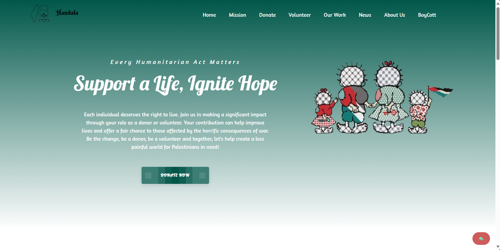

🌍 HANDAL - Site d'Aide et de Soutien
HANDAL est une plateforme en ligne dédiée à l'aide humanitaire, au boycott des produits israéliens, et à la promotion des produits tunisiens. Le site a pour objectif de sensibiliser et de soutenir le peuple palestinien, notamment en facilitant les collectes de fonds pour Gaza.

✨ Objectifs du projet
🌱 Encourager l'achat de produits tunisiens pour soutenir l'économie locale.

🚫 Promouvoir le boycott des produits israéliens dans le but de soutenir la cause palestinienne.

💖 Faciliter la collecte de dons pour aider la population de Gaza à travers des actions solidaires.

📢 Sensibiliser et mobiliser autour de la cause palestinienne en offrant une plateforme d'action et d'informations.

🚀 Fonctionnalités principales
🛍️ Encouragement à acheter des produits tunisiens et promouvoir les entreprises locales.

🚫 Section dédiée au boycott des produits israéliens, avec une liste de produits et marques à éviter.

💸 Collecte de fonds pour Gaza : un espace sécurisé permettant aux utilisateurs de faire des dons pour soutenir la population de Gaza.

📰 Actualités et sensibilisation : publication régulière d'articles sur la situation en Palestine et les initiatives de solidarité.

📢 Campagnes de sensibilisation et de soutien : possibilité de participer à des campagnes en ligne pour faire entendre la voix de la Palestine.

🛠️ Technologies utilisées
Frontend : HTML, CSS, JavaScript 
Backend : Node.js 
Base de données : MySQL
Paiement sécurisé : Intégration de solutions comme Stripe ou PayPal pour la collecte de fonds
API : Intégration d'APIs pour l'actualisation des informations et la gestion des dons.

